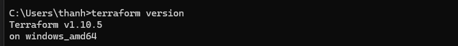
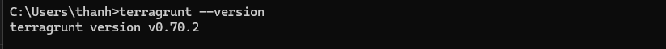
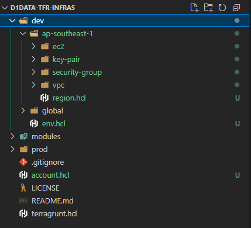

+++
title = 'Terragrunt là gì? Giải pháp DRY cho Terraform, thoát khỏi ác mộng Copy-Paste'
math = true
date = 2025-03-08T17:09:53Z
draft = false
series = ["Terragrunt"]
series_order = 1
+++

## Terragrunt đã cứu chàng Data Engineer năm đó

Cậu sinh viên tên Thành, năm nào giờ đã trở thành một Data Engineer đầy nhiệt huyết. Mới học xong khóa Terraform cơ bản, cậu hăng hái xung phong làm DevOps cho dự án chuyển đổi hệ thống on-premise lên cloud của công ty. Trách nhiệm của cậu? Provision toàn bộ services trên AWS cloud bằng Infrastructure as Code.

**Ban đầu, mọi thứ thật tuyệt…**

Cậu tự tin gõ những dòng code Terraform đầu tiên, mọi thứ chạy mượt mà. Deployment sạch sẽ, không lỗi, mọi người vỗ tay khen ngợi.

**Nhưng rồi... ác mộng ập đến.**

Dự án ngày càng phình to, gần 20 cái S3 bucket, chục cái job Glue, hàng trăm cái Lambda functions, vài chục role IAM, vài con database RDS, chưa kể subnet, security group nhiều vô kể. Nhìn lại codebase Terraform của mình và… tim như muốn rớt ra ngoài.

- Hàng nghìn dòng copy-paste giống hệt nhau, chỉ khác tên và một vài thuộc tính setting.
- Một thay đổi nhỏ liên quan đến phần base? Phải sửa ở nhiều chỗ. Quên sửa 1 chỗ là sai.
- Bảo trì, debug, thêm tính năng mới? Mất cả tiếng đồng hồ để tìm chỗ cần sửa.

Lúc này, cậu tự hỏi: "Chẳng lẽ Terraform là một cú lừa?"
Vừa bực bội vừa hoang mang, cậu lao đầu đi tìm hiểu từ google, chatgpt, youtube, và rồi cậu gặp [Terragrunt](https://terragrunt.gruntwork.io/). Click vào đường link, đập vào mắt cậu là dòng chữ `DRY and maintainable OpenTofu/Terraform code.`

**Vậy là cậu lao vào nghiên cứu. Và rồi… mọi thứ thay đổi.**

- ✔️ Không còn copy-paste hàng trăm lần để tạo các services tương tự nhau.
- ✔️ Quản lý multi-environment dễ dàng, nhất quán hơn.
- ✔️ Terraform modules trở nên gọn gàng, không bừa bộn.

Sau đây, là những gì cậu đã học được - những kinh nghiệm xương máu giúp bạn deploy infra một cách dễ dàng hơn với Terragrunt, cuối serial bài viết này là một demo về cách sử dụng terragrut trong môi trường doanh nghiệp lớn.

## Terragrunt là gì ?

Terragrunt là một wapper của Terraform, giúp bạn quản lý Terraform codebase một cách dễ dàng hơn. Terragrunt giúp bạn giải quyết những vấn đề phổ biến của Terraform:

- **DRY (Don't Repeat Yourself)**: Không lặp lại code, giúp codebase gọn gàng, dễ bảo trì.
- **Multi-environment**: Quản lý nhiều môi trường (dev, staging, prod) dễ dàng.
- **Remote state**: Quản lý terraform state file trên cloud (S3, GCS, Azure Blob Storage) một cách đơn giản hơn.

## Install

### Install Terraform

Do Terragrunt là một wapper của Terraform. Để sử dụng Terragrunt, bạn cần cài đặt Terraform trước. Bạn có thể cài Terraform thông qua [link này](https://developer.hashicorp.com/terraform/tutorials/aws-get-started/install-cli).

Với Windows, bạn có thể cài Terraform thông qua [chocolatey](https://chocolatey.org/):
Nếu chưa có chocolatey, bạn có thể cài đặt bằng cách tham khảo [link này](https://chocolatey.org/install#individual).

```powershell
choco install terraform
```

Verify Terraform đã cài đặt thành công:

```powershell
terraform --version
```

Check được version như sau là thành công.



### Install Terragrunt

Có lưu ý là version terragrunt trên chocolatey không phải là bản mới nhất, bạn có thể tải bản mới nhất từ [trang chủ](https://terragrunt.gruntwork.io/docs/getting-started/install/).

Sau khi tải về, giải nén và add vào PATH, chạy lệnh sau để kiểm tra terragrunt đã cài đặt thành công:

```powershell
terragrunt --version
```



## Cấu trúc thư mục

Mục tiêu của việc định nghĩa cấu trúc thư mục cho Terragrunt là giúp bạn quản lý codebase Terraform một cách dễ dàng, dễ bảo trì, và dễ mở rộng. Dưới đây là cấu trúc thư mục mà mình thấy phù hợp cho một dự án, tuy nhiên bạn có thể tùy chỉnh theo ý muốn của mình.

```bash
root/
├── prod
├── stage
└── dev
     ├── global
     ├── ap-southeast-1
          ├── vpc
          ├── s3
          │    ├── bucket-1
          │    └── bucket-2
          ├── ec2
          │    ├── server-1
          │    └── server-2
          └── database
               └── db-1
               └── db-2
```

Với cách sắp xếp như trên, khi nhìn vào thư mục `dev`, bạn sẽ thấy tất cả các resources của môi trường dev, và tương tự cho `stage`, `prod`.
Biết ngay các resources được deploy trên region nào.

- Thư mục `global` chứa các global services như IAM, Route53, CloudFront, WAF...
- Thư mục `ap-southeast-1` chứa các resources deploy trên region `ap-southeast-1`.
- Các thư mục con chứa các resources cụ thể như VPC, S3, EC2, RDS... mỗi resource là một sub folder.

Một số tổ chức bỏ qua folder `region` vì họ chỉ sử dụng 1 region duy nhất, nhưng mình khuyến nghị nên tạo folder `region` vì sau này biết đâu tổ chức sẽ deploy services nào đó trên region khác, hoặc cần migration services về region Thái Lan chẳng hạn 🤣

Một số tổ chức có thể chia thư mục theo `category` như Networking, Compute, Storage... nhưng các dự án mình đã triển khai không chia category vì mình thấy không cần thiết.
Ví dụ nếu chiase theo category, thì có thể chia như sau:

- Networking: VPC, Subnet, Route53, Security Group...
- Compute: EC2, ECS...
- Storage: S3, EBS...

## Ví dụ cụ thể

Dưới đây là ví dụ cụ thể triển khai 1 account AWS với:

- 1 region `ap-southeast-1`
- môi trường non-prod bao gồm `dev`, `stage`
- môi trường prod
- sử dụng 3 services `s3`, `glue`, `iam`

